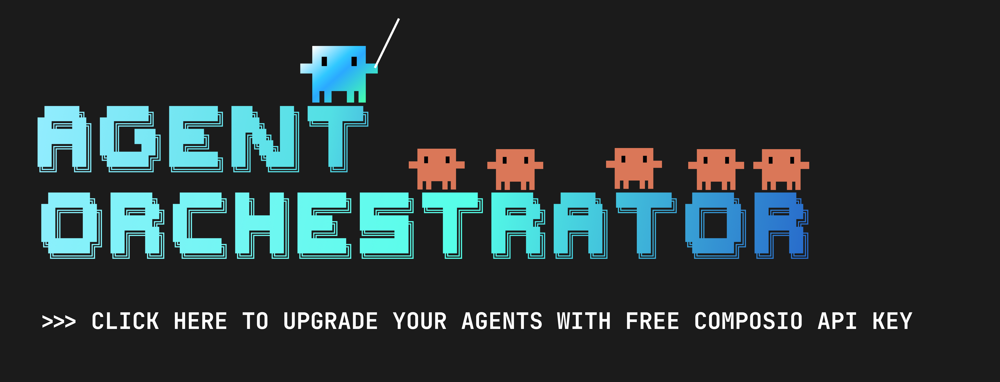
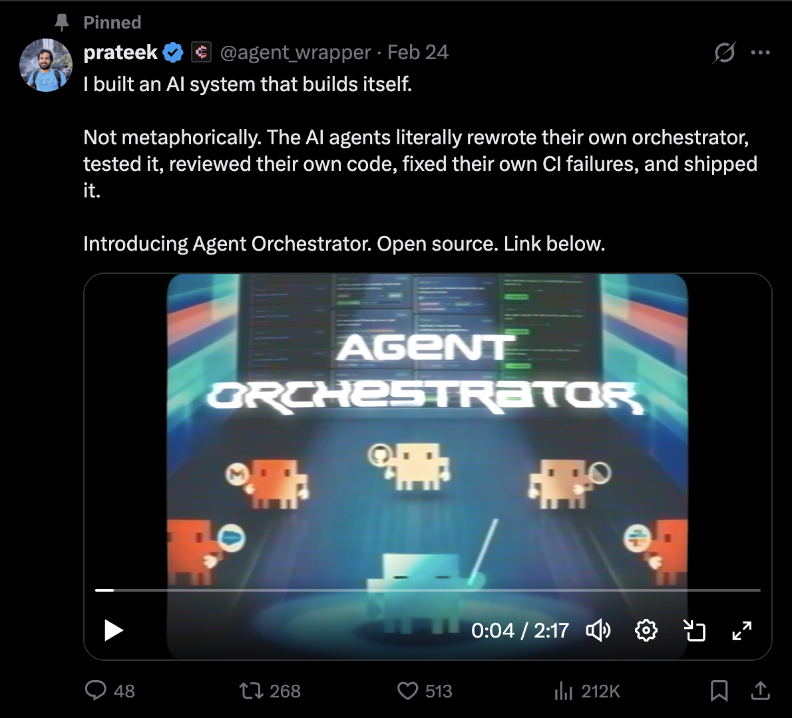
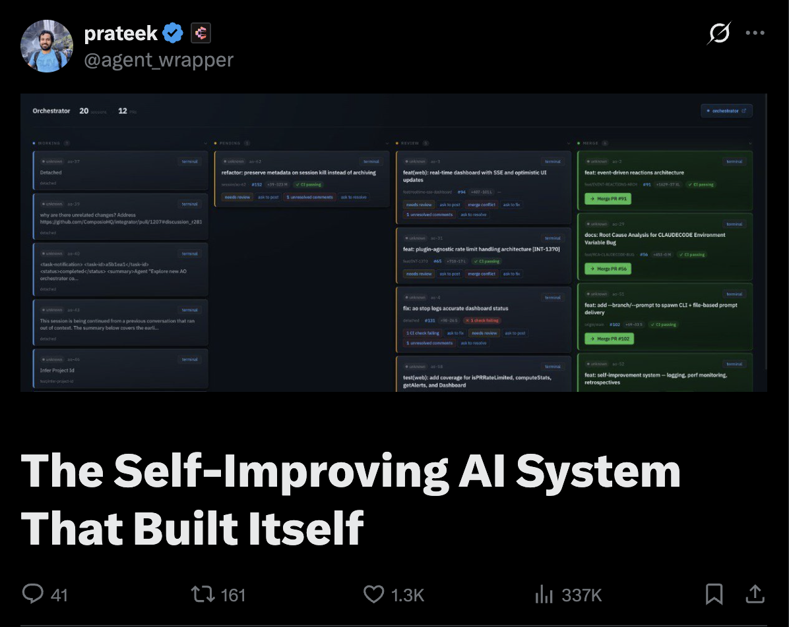

<h1 align="center">Agent Orchestrator — AO Fork</h1>

> **⚠️ This is a fork.** The canonical upstream is
> [**ComposioHQ/agent-orchestrator**](https://github.com/ComposioHQ/agent-orchestrator).
> This fork runs independently and may have diverged. PRs from upstream are regularly
> cherry-picked; fork changes can be proposed upstream via PR.</p>

<p align="center">
<a href="https://platform.composio.dev/?utm_source=Github&utm_medium=Banner&utm_content=AgentOrchestrator">
  
</a>
</p>

### This Fork vs Upstream

This fork adds **agentic CI infrastructure** on top of the upstream agent-orchestrator. The upstream is a standard CI repo; this fork is an autonomous coding pipeline where AO workers drive PRs to merge with zero operator intervention.

| Feature | ComposioHQ/agent-orchestrator | jleechanorg/agent-orchestrator (this fork) |
|---------|-------------------------------|------------------------------------------|
| Auto-merge | ❌ None | ✅ AO orchestrator + evolve loop |
| Skeptic agent | ❌ None | ✅ 7th merge gate (independent LLM verifier) |
| Evidence Gate | ❌ None | ✅ CI validates PR evidence bundle + claim class |
| CodeRabbit reviews | ❌ None | ✅ Per-PR reviews on every PR |
| Cursor Bugbot | ⚠️ Skipped | ✅ Runs on every PR |
| REST fallback | ❌ None | ✅ GH rate limit → REST fallback |
| OpenClaw notifier | ❌ None | ✅ Wired for Slack notifications |
| Self-hosted runners | ❌ | ✅ |
| CI jobs | lint, typecheck, test, test-web | same + evidence-gate, skeptic-gate |
| Workflows | 5 | 6 (+ skeptic-cron.yml) |

This fork's goal is **fully autonomous, zero-touch PR merging** for its own codebase. The upstream goal is a general-purpose orchestration tool.

<div align="center">

Spawn parallel AI coding agents, each in its own git worktree. Agents autonomously fix CI failures, address review comments, and open PRs — you supervise from one dashboard.

[](LICENSE)
[](https://discord.gg/UZv7JjxbwG)

</div>

---

Agent Orchestrator manages fleets of AI coding agents working in parallel on your codebase. Each agent gets its own git worktree, its own branch, and its own PR. When CI fails, the agent fixes it. When reviewers leave comments, the agent addresses them. You only get pulled in when human judgment is needed.

**Agent-agnostic** (Claude Code, Codex, Cursor, Gemini, Aider, OpenCode) · **Runtime-agnostic** (tmux, process) · **Tracker-agnostic** (GitHub, GitLab, Linear)

<div align="center">

## See it in action

<a href="https://x.com/agent_wrapper/status/2026329204405723180">
  
</a>
<br><br>
<a href="https://x.com/agent_wrapper/status/2026329204405723180"></a>
<br><br><br>
<a href="https://x.com/agent_wrapper/status/2025986105485733945">
  
</a>
<br><br>
<a href="https://x.com/agent_wrapper/status/2025986105485733945"></a>

</div>

## Quick Start

> **Prerequisites:** [Node.js 20+](https://nodejs.org), [Git 2.25+](https://git-scm.com), [tmux](https://github.com/tmux/tmux/wiki/Installing), [`gh` CLI](https://cli.github.com). Install tmux via `brew install tmux` (macOS) or `sudo apt install tmux` (Linux).

### Install

```bash
npm install -g @composio/ao
```

<details>
<summary>Permission denied? Install from source?</summary>

If `npm install -g` fails with EACCES, prefix with `sudo` or [fix your npm permissions](https://docs.npmjs.com/resolving-eacces-permissions-errors-when-installing-packages-globally).

To install from source (for contributors):

```bash
git clone https://github.com/jleechanorg/agent-orchestrator.git
cd agent-orchestrator && bash scripts/setup.sh
```
</details>

### Start

Point it at any repo — it clones, configures, and launches the dashboard in one command:

```bash
ao start https://github.com/your-org/your-repo
```

Or from inside an existing local repo:

```bash
cd ~/your-project && ao start
```

That's it. The dashboard opens at `http://localhost:3000` and the orchestrator agent starts managing your project.

### Add more projects

```bash
ao start ~/path/to/another-repo
```

## How It Works

1. **You start** — `ao start` launches the dashboard and an orchestrator agent
2. **Orchestrator spawns workers** — each issue gets its own agent in an isolated git worktree
3. **Agents work autonomously** — they read code, write tests, create PRs
4. **Reactions handle feedback** — CI failures and review comments are automatically routed back to the agent
5. **You review and merge** — you only get pulled in when human judgment is needed

The orchestrator agent uses the [AO CLI](docs/CLI.md) internally to manage sessions. You don't need to learn or use the CLI — the dashboard and orchestrator handle everything.

## jleechanorg Fork: OpenClaw Integration

This fork is used as the execution layer for `jleechanorg/jleechanclaw`.

> Note: This README defaults to the `jleechanorg/agent-orchestrator` fork clone URL.
> If you specifically want upstream, use
> [`ComposioHQ/agent-orchestrator`](https://github.com/ComposioHQ/agent-orchestrator).

Typical split of responsibilities:
- `jleechanorg/jleechanclaw` (OpenClaw harness): user intent parsing, context expansion, policy, and status updates.
- `jleechanorg/agent-orchestrator`: worker session lifecycle, isolated worktrees, PR execution loops, CI/review remediation.

Key integration points in this repo:
- Plugin contracts: `packages/core/src/types.ts`
- OpenClaw notifier plugin: `packages/plugins/notifier-openclaw/src/index.ts`
- GitHub SCM plugin: `packages/plugins/scm-github/src/index.ts`
- tmux runtime plugin: `packages/plugins/runtime-tmux/src/index.ts`

Example notifier wiring (`agent-orchestrator.yaml`) — `openclaw` is also listed in the supported notifier options table below:

```yaml
defaults:
  notifiers: [desktop, openclaw]

notifiers:
  openclaw:
    plugin: openclaw
    url: http://127.0.0.1:18789/hooks/agent
    token: ${OPENCLAW_HOOKS_TOKEN}
```

## Configuration

`ao start` auto-generates `agent-orchestrator.yaml` with sensible defaults. You can edit it afterwards to customize behavior:

```yaml
# agent-orchestrator.yaml
port: 3000

defaults:
  runtime: tmux
  agent: claude-code
  workspace: worktree
  notifiers: [desktop]

projects:
  my-app:
    repo: owner/my-app
    path: ~/my-app
    defaultBranch: main
    sessionPrefix: app

reactions:
  ci-failed:
    auto: true
    action: send-to-agent
    retries: 2
  changes-requested:
    auto: true
    action: send-to-agent
    escalateAfter: 30m
  approved-and-green:
    auto: false # flip to true for auto-merge
    action: notify
```

CI fails → agent gets the logs and fixes it. Reviewer requests changes → agent addresses them. PR approved with green CI → you get a notification to merge.

See [`agent-orchestrator.yaml.example`](agent-orchestrator.yaml.example) for the full reference, or run `ao config-help` for the complete schema.

## Plugin Architecture

Eight slots. Every abstraction is swappable.

| Slot      | Default     | Alternatives                 |
| --------- | ----------- | ---------------------------- |
| Runtime   | tmux        | process                      |
| Agent     | claude-code | codex, cursor, gemini, aider, opencode |
| Workspace | worktree    | clone                        |
| Tracker   | github      | gitlab, linear               |
| SCM       | github      | gitlab                       |
| Notifier  | desktop     | slack, composio, webhook, openclaw |
| Terminal  | iterm2      | web                          |
| Lifecycle | core        | —                            |

All interfaces defined in [`packages/core/src/types.ts`](packages/core/src/types.ts). A plugin implements one interface and exports a `PluginModule`. That's it.

## Why Agent Orchestrator?

Running one AI agent in a terminal is easy. Running 30 across different issues, branches, and PRs is a coordination problem.

**Without orchestration**, you manually: create branches, start agents, check if they're stuck, read CI failures, forward review comments, track which PRs are ready to merge, clean up when done.

**With Agent Orchestrator**, you: `ao start` and walk away. The system handles isolation, feedback routing, and status tracking. You review PRs and make decisions — the rest is automated.

## Documentation

| Doc                                      | What it covers                                               |
| ---------------------------------------- | ------------------------------------------------------------ |
| [Setup Guide](SETUP.md)                  | Detailed installation, configuration, and troubleshooting    |
| [CLI Reference](docs/CLI.md)             | All `ao` commands (start, stop, spawn, status, etc.)          |
| [Examples](examples/)                    | Config templates (GitHub, Linear, multi-project, auto-merge) |
| [Development Guide](docs/DEVELOPMENT.md) | Architecture, conventions, plugin pattern                    |
| [Contributing](CONTRIBUTING.md)          | How to contribute, build plugins, PR process                 |

## CLI Commands

The `ao` CLI provides these commands:

```bash
ao start [project|url]    # Start orchestrator with project config or clone repo
ao stop                   # Stop running orchestrator
ao spawn <prompt>        # Spawn new agent session
ao status                 # Show session status
ao dashboard             # Open web dashboard
ao config-help           # Show config schema reference
ao doctor                # Run diagnostics
```

Run `ao --help` for full command list.

## Development

```bash
pnpm install && pnpm build    # Install and build all packages
pnpm test                      # Run tests
pnpm dev                       # Start web dashboard dev server
```

See [docs/DEVELOPMENT.md](docs/DEVELOPMENT.md) for code conventions and architecture details.

## Contributing

Contributions welcome. The plugin system makes it straightforward to add support for new agents, runtimes, trackers, and notification channels. Every plugin is an implementation of a TypeScript interface — see [CONTRIBUTING.md](CONTRIBUTING.md) and the [Development Guide](docs/DEVELOPMENT.md) for the pattern.

## License

MIT

